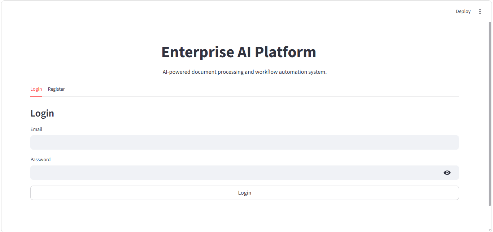
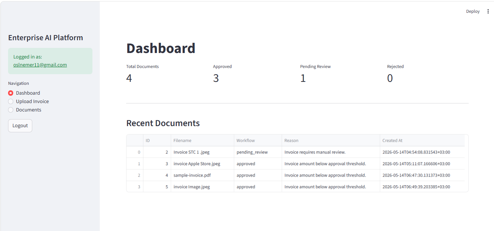
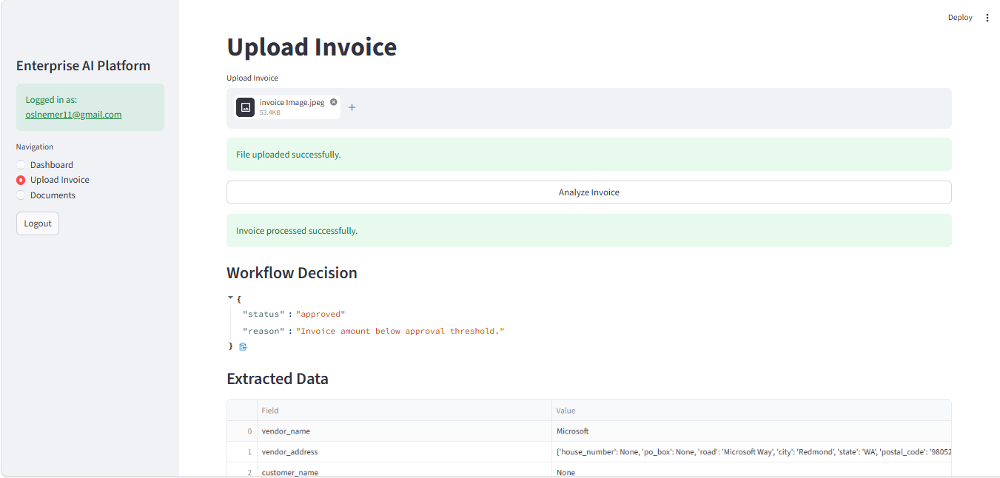
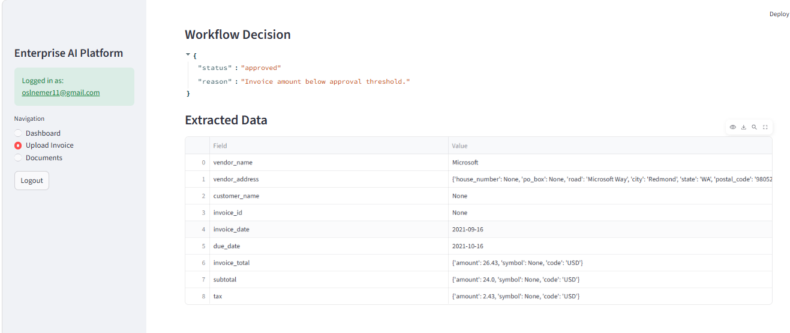
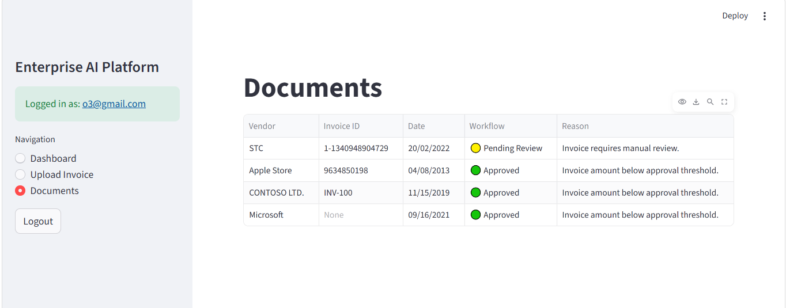

# Enterprise AI Document Platform

An AI-powered document processing platform built using FastAPI, Streamlit, PostgreSQL, and Azure Document Intelligence.

The platform automates invoice processing by extracting structured information from invoices using OCR and AI services, then applying workflow automation logic for approval and review decisions.

---

# Live Demo

Frontend:
https://enterprise-ai-document-platform-fwkqkrasedmlnwgz9suw5n.streamlit.app/

Backend API:
https://enterprise-ai-document-platform.onrender.com

---

# Features

- JWT Authentication
- AI Invoice OCR Processing
- Azure Document Intelligence Integration
- Workflow Automation
- PostgreSQL Cloud Database
- FastAPI REST APIs
- Streamlit Dashboard
- Cloud Deployment

---

# Tech Stack

## Backend
- FastAPI
- SQLAlchemy
- PostgreSQL

## Frontend
- Streamlit
- Pandas

## AI & OCR
- Azure Document Intelligence

## Deployment
- Render
- Streamlit Community Cloud

---

# Screenshots
## LogIN



## Dashboard


## Upload Invoice




## Documents

---

# Installation

```bash
git clone https://github.com/os0n/enterprise-ai-document-platform.git

```
---
# Future Improvements
Advanced workflow rules
Admin dashboard
PDF report exports
Multi-document processing
AI-powered anomaly detection
Docker deployment
Role-based access control

# Author
Osama Al Nemer
AI & Data Science Engineer
